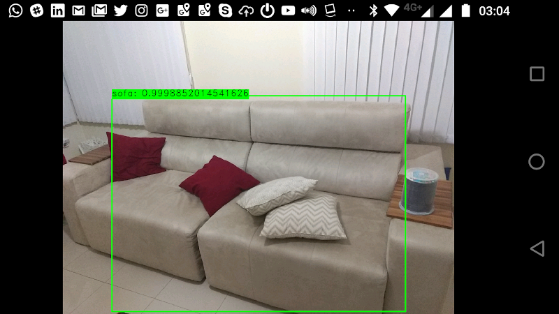

This project this is a example where you'll know how to run deep learning networks on Android device using OpenCV deep learning module.

Do you need download MobileNet object detection model from  https://github.com/chuanqi305/MobileNet-SSD. This application need a configuration file MobileNetSSD_deploy.prototxt and weights MobileNetSSD_deploy.caffemodel. After the download, put MobileNetSSD_deploy.prototxt and MobileNetSSD_deploy.caffemodel into app/build/intermediates/assets/debug folder.

Usage:
Android application created to pronounce for the visually impaired the objects present in front of the camera using opencv, TBB and Deep Learning.

When you run the application, clicking on the cell phone screen will pronounce the name of the objects identified with the deep learning technology of the opencv library. The system locates the previously trained object in real time.

Approach:

The technology uses the mobile processor and does not use the internet to identify the objects. The project uses the Deep Learning module ( dnn )  of the opencv library available after version 3.3.1. The library uses the opencv and TBB library features compatible with ARM and Intel processors. In the future Android NN API technology will be used with Movidius in Android 8.1

Technologies Used:
- OpenCV
- TBB
- In the future : Movidius  in Android 8.1

Version 8.0
* Backward compatibility with old Android 
* Bug fix - screen overlay detected
* Remove OpenCV Manager dependencies
* Bug fix
* Add request permission hardware

Version 3.0 
* Bug fix in armeabi processor
* Add dependencies links

Version 1.0
* First version

Alessandro de Oliveira Faria
email: cabelo@opensuse.org

